<h1>Application de E-commerce Avec architecture microservice</h1>


<h2>Introduction</h2>
<p>
</p>

<h2> Les différents microservices</h2>
<ul>
<li>Service Utilisateur : Gère l'authentification, l'inscription et la gestion
</li>
</ul>

<h2>Technologies Utilisées</h2>

<h3>1. Customers Service</h3>

- Creation :
<p>
on crée un projet spring boot avec les dépendances suivants:
<ul>
<li>Spring web</li>
<li>Spring Data JPA</li>
<li>H2 Database</li>
<li>Spring Data Rest</li>
<li>Spring Boot DevTools</li>
<li>Lombok</li>
<li>Spring Boot Actuator</li>
<li>Spring cloud Eureka client</li>
<li> Spring cloud cloud configuration</li>
</ul>

Les trois dernieres dépendances sont pour la mise en placae du microservice discovery et la configuration centralisée. Quant aux restes il sont juste pour
la misev en placec d un projet spring boot classique.
</p>

<h4>execution de customers service</h4>

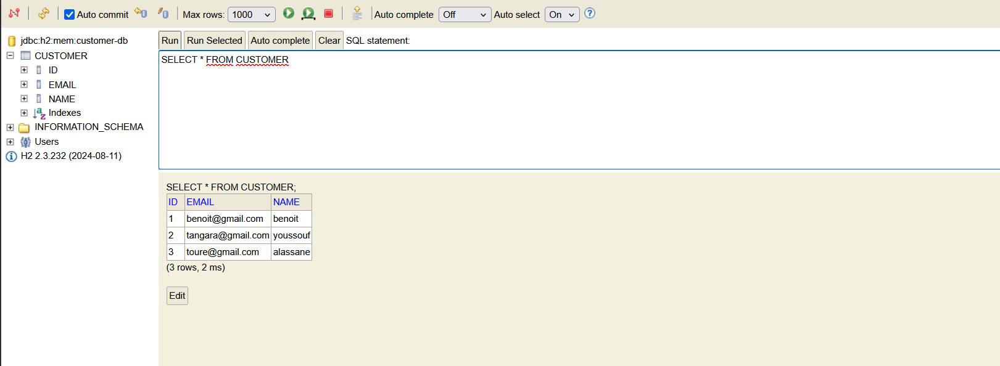

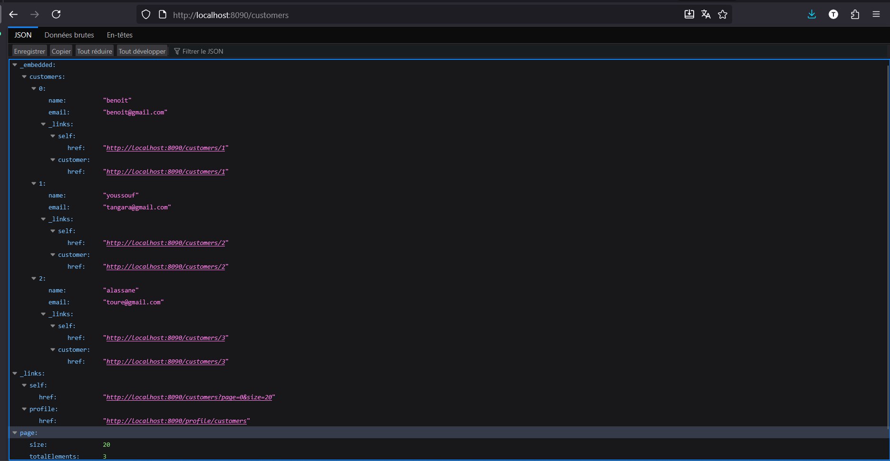

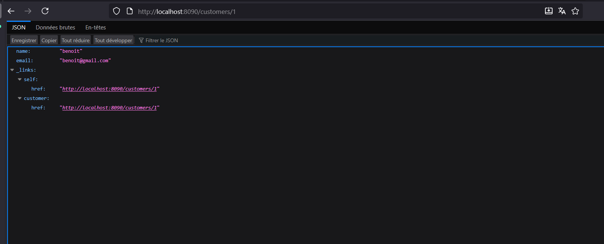

- l'API avec  une serilistion contenant Id.
par defaut  lorsqu on a utiliser Spring data rest  pour la sérialisation des entités, les IDs de la classe sont ignorées par defaut , pour la definir on definit une classe de configuration  pour définir les attributs à serialiser :

[classe de configuration ](./customer-service/src/main/java/enset/ma/customerservice/config/RestRepositoryConfig.java)

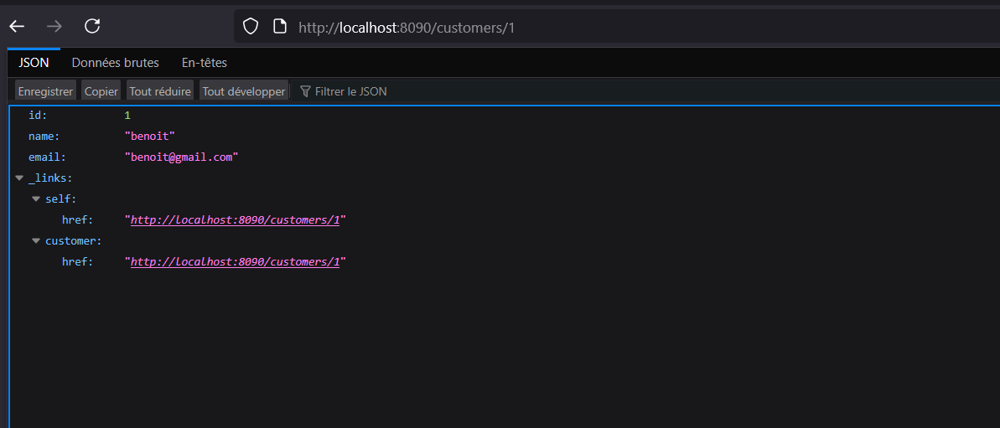

-  Création d'une projection :
Par defaut,  tous les attributs sont envoyer au client lorsqu'on utilise  spring data rest, Pour donner la possiblité au client de pouvoir choisir les attributs lors des requetes, on utilise les projections. Ainsi nous avons crée trois différentes projections pour l'entité Customer.
   - all : pour  envoyer tous les attributs
   - name : pour envoyer juste le nom 
   - email : pour envoyer juste l'email
 Cette projection est definit le package entiti : [all](./customer-service/src/main/java/enset/ma/customerservice/entities/CustomerProjection.java) ,
     [name](./customer-service/src/main/java/enset/ma/customerservice/entities/EmailProjection.java),[email](./customer-service/src/main/java/enset/ma/customerservice/entities/EmailProjection.java)


<h3>1. Inventory  Service</h3>

- Creation :
On recree un  module   spring boot avec  meme dépendance que  customers services:

- Execution de inventory service

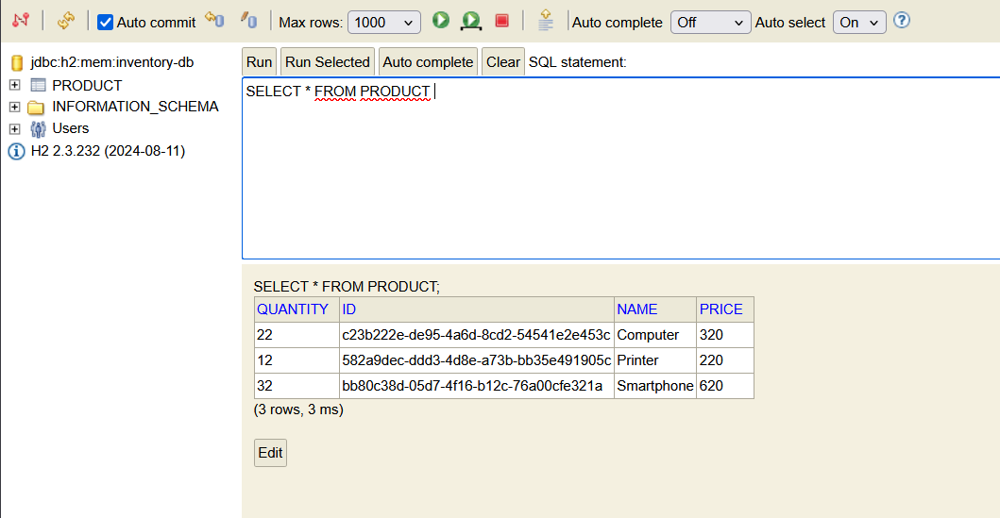

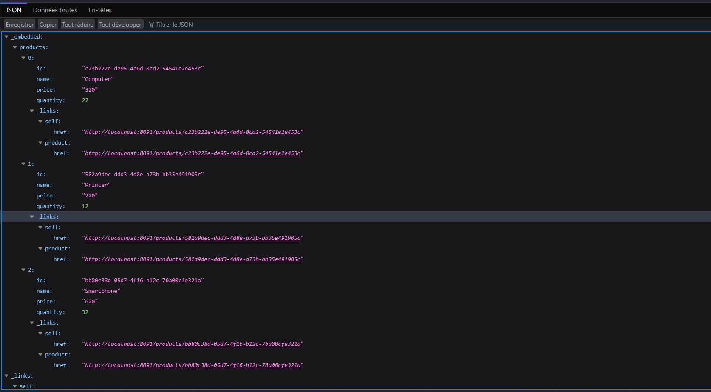

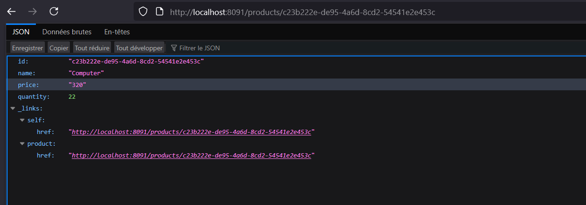
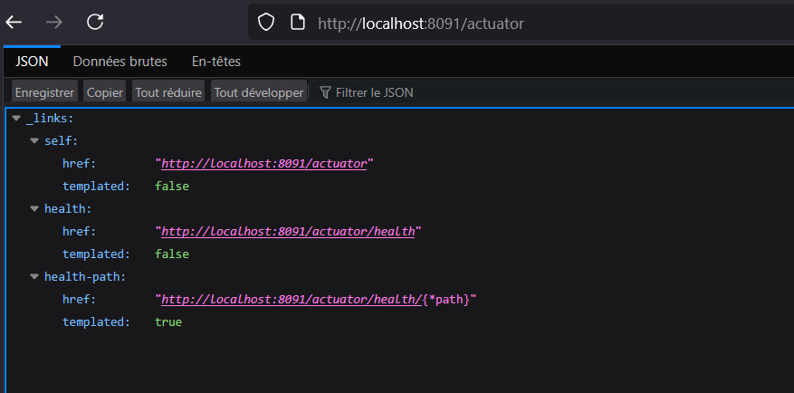

<h3>3. Creation du Gateway service </h3>

- Creation : 
On crée un module spring boot avece les dépendacne suivantes :
- Gateway
- Eureka Discovery Client
- Spring Boot Actuator
- Spring cloud config client

- Execution du gateway service


On fait la configuration du gateway service configuration statique dans le fichier application.yml  en definissant les route et on peut  à present  consulter les deux service precedent en passant per le gateway plutot que de faire  les requetes directements vers les service :
 configuration sans passer par le discovery service on fait lac onfifguration en donnant l'url de chaque service dans le fichier application.ymal  du gateway service :
```yamlspring:
  spring:
  cloud:
    gateway:
      mvc:
        routes:
          - id: r1
            uri: http://localhost:8090
            predicates:
              - Path= /customers/**

          - id: r2
            uri: http://localhost:8091
            predicates:
              - Path= /products/**
```

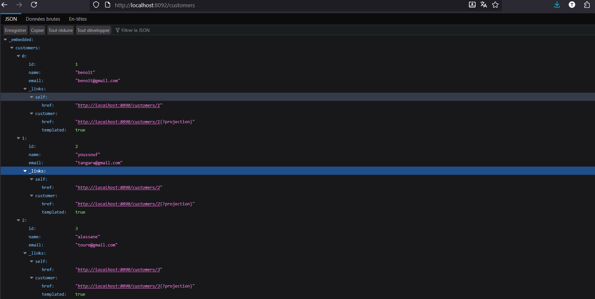

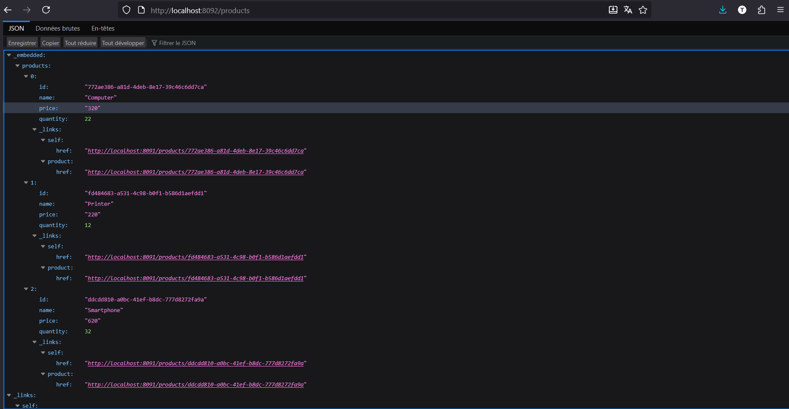
;

On peut proceder à une configuration  en utilisant  eurka discovery service. 


<h3>4. Creation du service de discovery </h3>

Pour cela on va créer un nouveau module Sprind boot pour le service de discovery avec les dépendance suivante Eureka Server.

pour activer discorvery server on utilise l'annotation @EnableEurekaServer dans la classe principale de l'application.

On modifie le fichier de configuration précédente pour configurer le gateway commme suit :

```yaml
spring:
  cloud:
    gateway:
      mvc:
        routes:
          - id: r1
            uri: lb://CUSTOMER-SERVICE
            predicates:
              - Path= /customers/**

          - id: r2
            uri: lb://INVENTORY-SERVICE
            predicates:
              - Path= /products/**
```
- Execution du discovery service

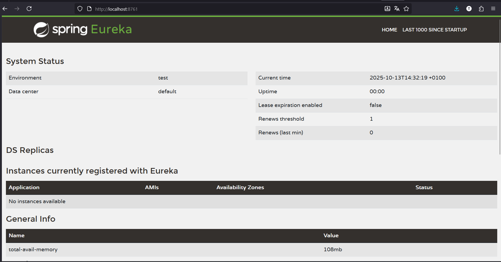
En activant  les services créer  précedement on peut les voir dans l'interface de discovery service :
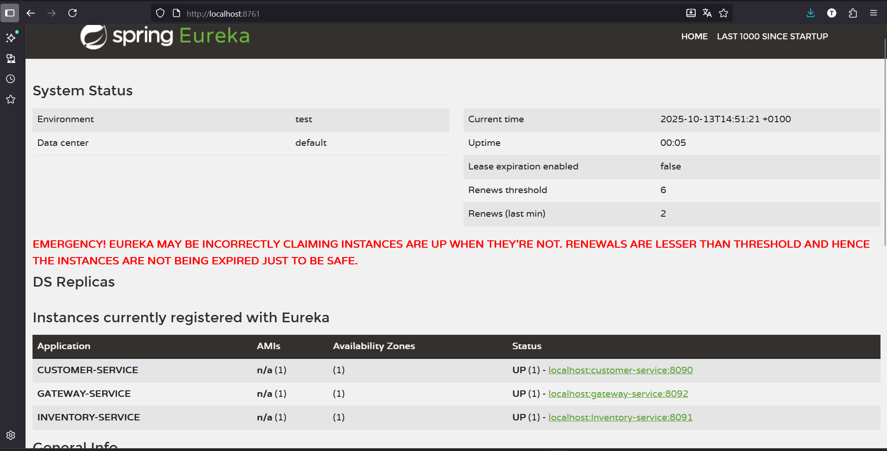

On procde en suite a la configuration dynamique en utilsiant le fichier applicaiton.ymal creer precedemment dans le gateway service.

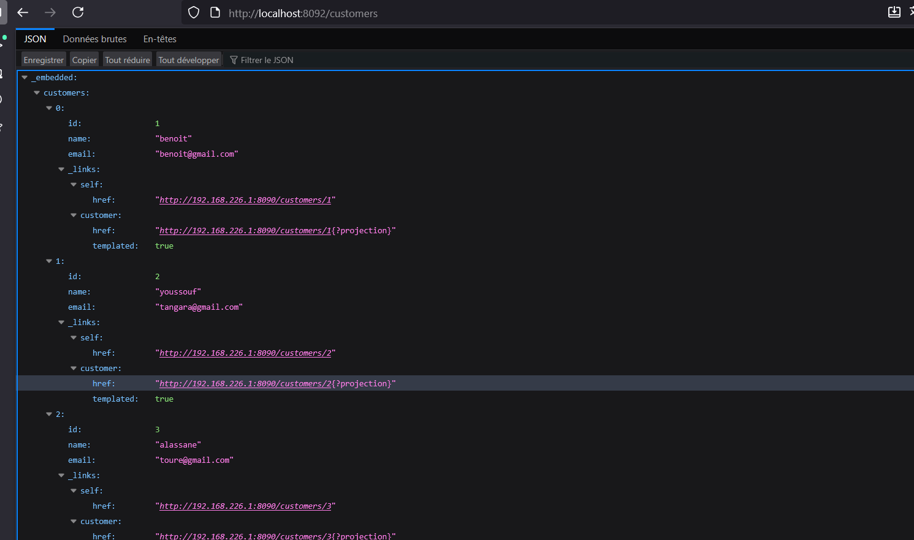

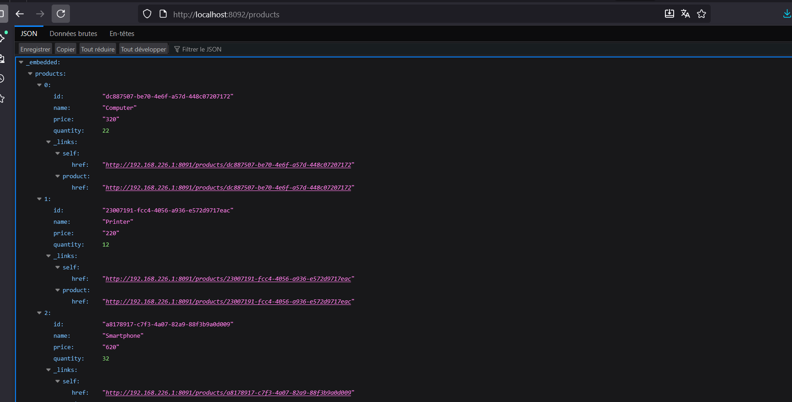

-Configuration dinamique du gateway service:

On Fait la configuration dynamique en utilisant le discovery service  en donnant le nom definisant dans le fichier main du gateway service  un bean de type RouteLocator  qui va definir les routes en utilisant  discovery service pour la resolution des noms des services.
```java
@SpringBootApplication  
DiscoveryClientRouteLocatorDefinition locator()
    ReactiveDiscoveryClient rdc, DiscoveryLocatorProperties dlp) {
    return new DiscoveryClientRouteLocator(rdc, dlp);
    }

````

On  peut a present consulter les service en paasant dans les  path des requestes les  noms des services en majuscule  et  le reste par la ressource demandée.


